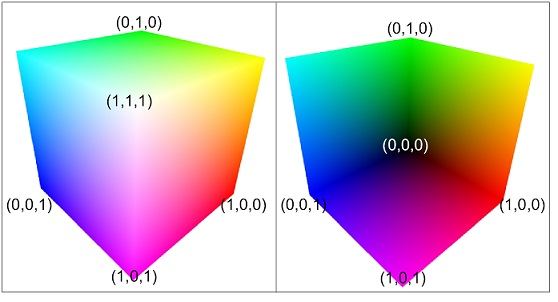

##volume rendering using ray casting algorithm ##

- This project is a demo to implement the volume rendering using Raycasting algorithm with modern OpenGL API and the shading language glsl.
- Written in C++ but in C style, just to explain the notation of Raycasting algorithm.
- To compile it, you need MinGW and Gnu Make and g++, only support Windows platform currently, it would be trivial to port to Linux platform.
- Dependencies: OpenGL4.0 and newer versions, [glew](http://glew.sourceforge.net/), [freeglut](http://freeglut.sourceforge.net/) and [glm](http://glm.g-truc.net/ ), already included in this repo. If there is something wrong, maybe you need to compile the libs yourself.
- It is a two pass solution of the Raycasting algorithm.
- 
- 
- Just `make` in the command line to compile it.

## references: ##
- [Acceleration Techniques for GPU-based Volume Rendering](http://cglab.snu.ac.kr/lectures/05-2/graphics/notes/papers/Acceleration%20Techniques%20for%20GPU.pdf)
- [Raycasting tutorial](http://www.voreen.org/129-Ray-Casting.html)
- [A simple and flexible volume rendering framework for graphics-hardware-based raycasting](http://dl.acm.org/citation.cfm?id=2386498)

## Volume Data Source ##
- [The Stanford volume data archive](http://www-graphics.stanford.edu/data/voldata/)